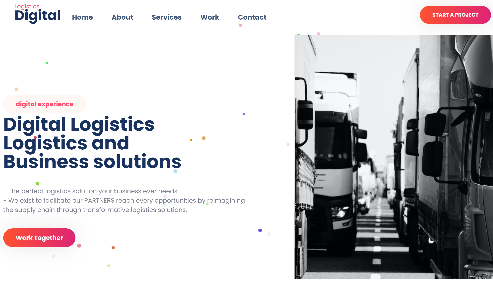

<br />
<br />

<h1 align="center" >Digital Logistics</h1>
<h2 align="center">Using web fundamentals with beautiful animations</h2>

<br />
<br />

<p align="center">
  
  <br />
  <br />
  
</p>

## ✨ Tech Stack
- HTML
- CSS
- JS
- Masonry JS
- Rellax JS
- Animate.css

## :rocket: Quick start

Start developing locally.

### Step 1: Clone the repo
Fork the repository. then clone the repo locally by doing -

```sh
git clone https://github.com/Osman-Rasooli/Digital_Logistics.git
```

### Step 2: Open
```
index.html
```

## :v: Contributing

After cloning & setting up the local project you can push the changes to your github fork and make a pull request.

> You can also run the tests locally to see if everything works fine with

### Make changes


### Pushing the changes

```bash
git add .
git commit -m "feat: added new stuff"
git push YOUR_REPO_URL develop
```


### Don't forget to leave a star ⭐.
